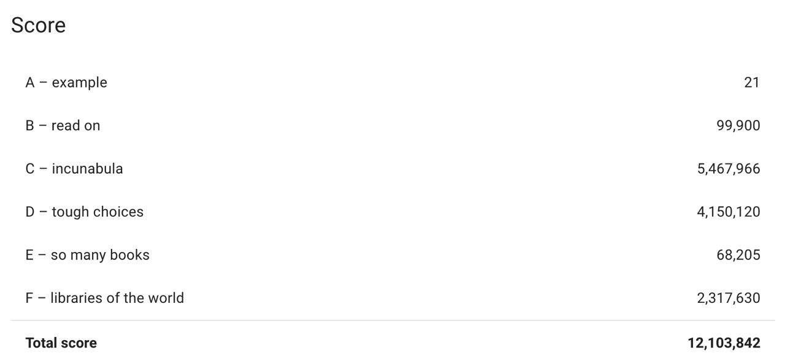

# HashCode 2020 - Book Scanning

Our naive solution for the HashCode 2020.
At each timeslot we consume the library with the minor signup time.

## Problem Introduction 
Introduction
Books allow us to discover fantasy worlds and beer understand the world we live in. They enable us to learn about everything from photography to compilers... and of course a good book is a great way to relax!
Google Books is a project that embraces the value books bring to our daily lives. It aspires to bring the world's books online and make them accessible to everyone. In the last 15 years, Google Books has collected digital copies of 40 million books in more than 400 languages1, paly by scanning books from libraries and publishers all around the world.
In this competition problem, we will explore the challenges of seing up a scanning process for millions of books stored in libraries around the world and having them scanned at a scanning facility.
## Task
Task
Given a description of libraries and books available, plan which books to scan from which library to maximize the total score of all scanned books, taking into account that each library needs to be signed up before it can ship books.
## Usage
```sh
cat problem.txt > python3 hashcode.py
```

## Score


## Authors

*   **Andrea Bacciu**  - [github](https://github.com/andreabac3)
*   **Riccardo Taiello**  - [github](https://github.com/Riccardinho22)
*   **Alessandro Scandone**  - [github](https://github.com/ascandone)
